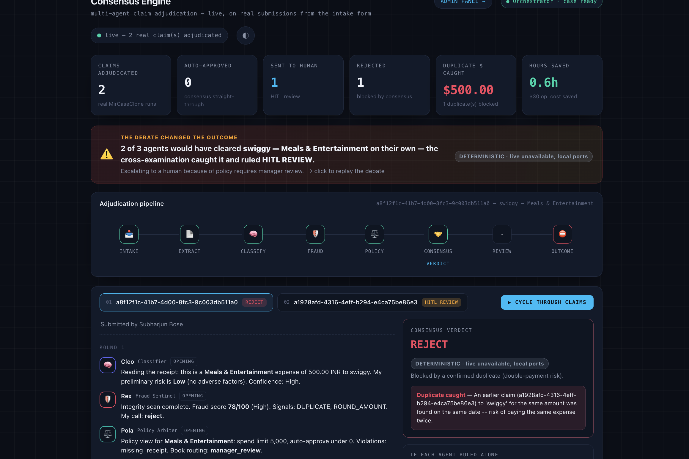
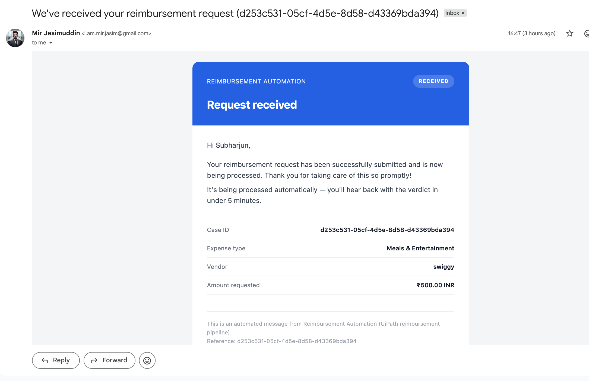
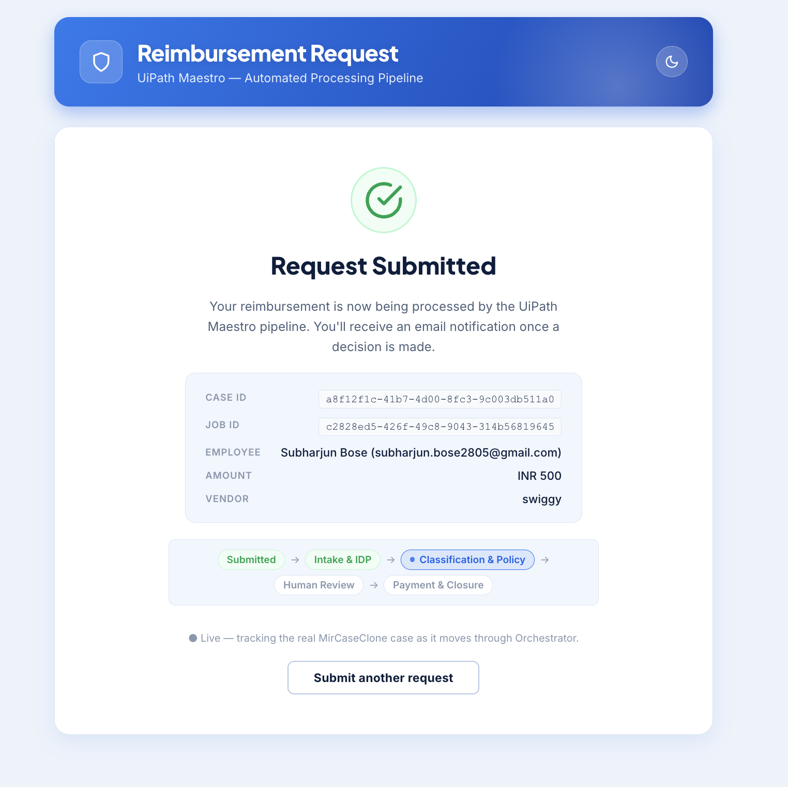
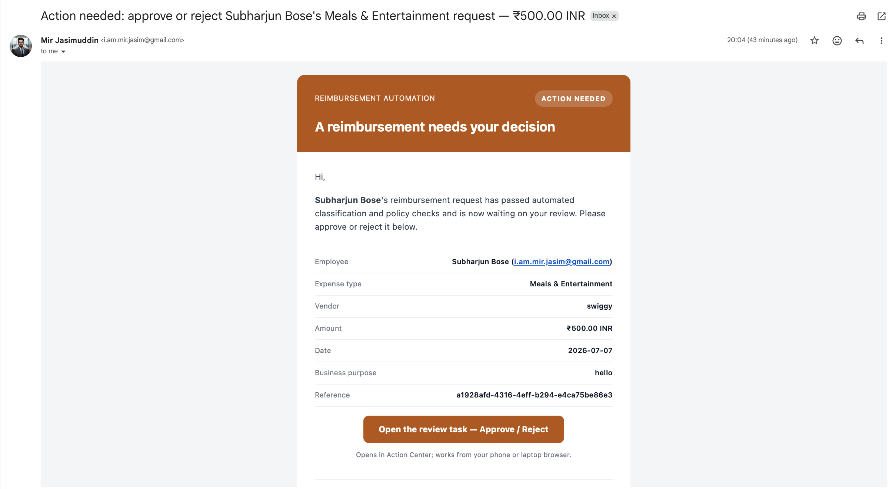
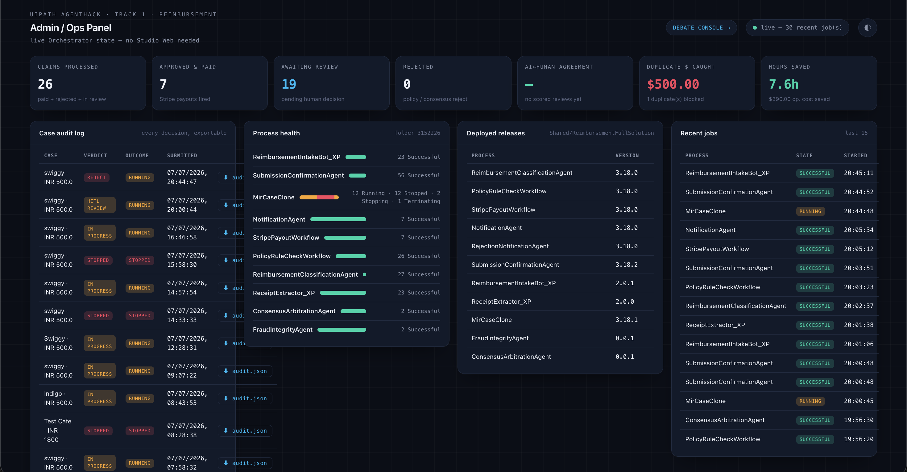

# Reimbursement Full Solution — UiPath AgentHack 2026 (Track 1)

An end-to-end, **agentic** expense-reimbursement system built on **UiPath Maestro
Case Management**, driven by a public intake site and made transparent by a
multi-agent **Consensus Engine**. A claim submitted on the live site flows
through Intake → IDP → Classification → Policy → Human Review → Stripe payout →
Notification — every step a **real Orchestrator job**, not a mock.

> **Live demo:** https://reimbursement-intake-v2.onrender.com
> &nbsp;·&nbsp; Form `/` &nbsp;·&nbsp; Consensus Engine `/dashboard` &nbsp;·&nbsp; Ops panel `/admin`

---

## What's in this repo

This is the **umbrella submission repo** — everything that makes up the solution,
in one place. Each app also lives in its own standalone repo (linked below).

| Folder | What it is |
|---|---|
| [`source/`](source/) | The **UiPath Maestro Case + agents/workflows** package sources (extracted): `MirCaseClone` (the Case), `ReimbursementClassificationAgent`, `PolicyRuleCheckWorkflow`, `StripePayoutWorkflow`, `NotificationAgent`, `RejectionNotificationAgent`, `SubmissionConfirmationAgent`, `ReceiptExtractor_XP`, `ReimbursementIntakeBot_XP`, plus the two deployed Consensus Engine agents `FraudIntegrityAgent` (LLM judgment) & `ConsensusArbitrationAgent` (LLM final call) — `ConsensusArbitrationWorkflow` is the earlier deterministic-only workflow, kept for reference. |
| [`downloaded_packages/`](downloaded_packages/) | The corresponding `.nupkg` build artifacts. |
| [`reimbursement-intake-v2/`](reimbursement-intake-v2/) | The **live app** (FastAPI + React SPA): the public intake form, the Consensus Engine `/dashboard`, and the `/admin` ops panel. This is what triggers the Case. |
| [`reimbursement-admin-dashboard/`](reimbursement-admin-dashboard/) | The **standalone** live-ops + consensus-debate dashboard (earlier split-out service; kept for reference). |

**Standalone repos:**
- Case source — https://github.com/Subharjun/ReimbursementFullSolution-source
- Intake app — https://github.com/Subharjun/reimbursement-intake-v2
- Admin dashboard — https://github.com/Subharjun/reimbursement-admin-dashboard

---

## Architecture

```
  Public intake site  (reimbursement-intake-v2 on Render)
        │  POST /api/submit  → uploads receipt to the Receipt bucket
        │                    → Orchestrator StartJobs (with EntryPointPath)
        ▼
  ┌──────────────────────────  MirCaseClone  (Maestro Case, serverless) ──────────────────────────┐
  │  Intake (Email) ─▶ IDP Digitize (Receipt Extraction) ─▶ Classification                          │
  │        ├─ ReimbursementClassificationAgent  (LLM agent)                                          │
  │        ├─ PolicyRuleCheckWorkflow           (dynamic policy DB)                                  │
  │        └─ classification-approval-app       (Human review · HITL)                                │
  │   ├─(approve)─▶ StripePayoutWorkflow ─▶ NotificationAgent ─▶ end                                 │
  │   └─(reject)──▶ RejectionNotificationAgent ─▶ end                                                │
  └─────────────────────────────────────────────────────────────────────────────────────────────────┘
        │  (observationally, in parallel — never dispatches actions)
        ▼
  Consensus Engine  (/dashboard) — a 3-round multi-agent debate over each claim
        Cleo (Classifier) · Rex (Fraud Sentinel) · Pola (Policy Arbiter) → auditable verdict
```

### The Consensus Engine (the differentiator)
Invoice/receipt reading is commoditized. What isn't: four specialised agents
**cross-examining each other** and reaching a defensible, auditable consensus —
with the dissent recorded. All four reasoning stages run as **real Orchestrator
jobs**, each with a per-agent graceful fallback to a deterministic local port if
a job faults or a release key drifts — so the dashboard never goes dark:

- **Classifier** (`ReimbursementClassificationAgent`) and **Policy**
  (`PolicyRuleCheckWorkflow`) — the original two deployed reasoning stages.
- **Fraud Sentinel** (`FraudIntegrityAgent`) — deterministic detectors are the
  floor; an LLM synthesises a judgment on top and may **escalate** risk when
  weak signals compound. A monotonic guardrail forbids ever softening the
  verdict below the detectors, and it can never fabricate a duplicate/split flag.
- **Arbitration** (`ConsensusArbitrationAgent`) — deterministic precedence is the
  compliance floor; the LLM makes the final call above it. A monotonic guardrail
  means a hard compliance block (over spend limit / confirmed duplicate / policy
  reject) can **never** be soft-overridden by the LLM.
- Each card shows a **⚡ LIVE / HYBRID / DETERMINISTIC** badge; click a job id to
  verify the real Orchestrator job. `mode="live"` now requires all four stages to
  have run as real jobs. A pinned hero surfaces the case where the **debate
  changed the outcome** (agents that would have approved solo, caught by
  cross-examination).
- The intake success screen shows a **live case timeline** driven off the real
  MirCaseClone stage cursor.



---

## Version 2 Improvements

Version 1 proved the automation worked end-to-end. Version 2 is a set of
improvements driven by real feedback — from users, from our own team, and from
mentors — closing the gaps between "it works" and "it's actually good to use."

### 1. Receiver Email Notification

Version 1 worked — claims got processed. But feedback kept saying the same
thing: the person a claim reached had no idea it had arrived until they
happened to check. So version 2 fixed it — the moment a claim reaches the
concerned person, they get an automatic email. No manual follow-up, no "did
you get my claim?" pings. A small addition on paper, but it came straight from
real users, and it's the difference between an automation that technically
works and one that actually removes friction for the people using it.



### 2. Live Status Tracker for the Submitter

Once someone submitted a claim in version 1, it disappeared into the system.
This one came from the team's own internal discussion — we asked ourselves: if
I submitted this claim, wouldn't I want to know where it is right now? That
became the live tracker in version 2: the submitter can check, in real time,
exactly where their claim stands — submitted, under review, approved, paid
out. Some of the best improvements don't come from bug reports — they come
from honestly asking what the experience is missing.



### 3. Customized Human-in-the-Loop Approval Email

In version 1, the human review step was clunky — reviewers had to dig through
the system to find what they were even supposed to approve or reject. The push
to fix this came from a mentor's feedback, which changed how we thought about
the whole thing. Version 2 gives reviewers a custom email built for that exact
decision — the context is already there, with a simple Approve/Reject action.
We didn't try to remove humans from the loop; some decisions need a person's
judgment. We just made it effortless for that person to make the call quickly,
instead of hunting for information first.



### 4. Manager/Director Dashboard

Version 1 proved the automation worked. What it couldn't do was answer the
question leadership actually cares about: is this saving us anything? A
mentor's feedback reshaped our thinking here — that a working automation means
little if you can't show the value behind it. That lesson became the admin
dashboard in version 2, built for managers and directors, tracking:

- Total number of claims processed
- Time saved vs. the manual process
- Estimated FTE (people-hours) saved
- Overall business ROI

It turned "we built something cool" into "here's the number behind it."



---

## Tech

- **UiPath**: Maestro Case Management (`MirCaseClone`), coded/LLM agents, API
  workflows, Integration Service (Gmail), Action Center (HITL), Orchestrator
  (serverless jobs), Storage buckets.
- **App**: Python 3 · FastAPI · React + Vite (TypeScript) · deployed on Render
  (Docker). Auth via OAuth `client_credentials` (Confidential External App).
- **Payout**: Stripe (inside `StripePayoutWorkflow`). **Email**: Gmail via
  Integration Service.

## Tenant & key identifiers

- Tenant: `https://staging.uipath.com/hackathon26_332/DefaultTenant` (UiPath Labs / AgentHack)
- Folder: `Shared/ReimbursementFullSolution` — key `a1dc9c4b-4ba4-4ac1-837d-9c6b093457a3`, id `3152226`
- Case: `MirCaseClone` (`ReimbursementApiSolution.Case.mir_clone_project`), entry point `/content/caseplan.json.bpmn#trigger_HVs1vR`

> Orchestrator **release keys drift on every redeploy** — the app reads them from
> env-overridable constants. See each app's README for the current values and the
> read-only inspection cookbook.

---

## Run it locally

**Intake app** (form + `/dashboard` + `/admin`):
```bash
cd reimbursement-intake-v2
cp .env.example .env          # set UIPATH_CLIENT_ID/SECRET, ADMIN_USER/PASSWORD
npm install && npm run build  # build the React SPA into dist/
pip install -r requirements.txt
uvicorn api:app --reload      # http://localhost:8000
```

See [`reimbursement-intake-v2/README.md`](reimbursement-intake-v2/README.md) and
[`reimbursement-admin-dashboard/README.md`](reimbursement-admin-dashboard/README.md)
for full details, env vars, and the standing operational rules.

---

*Built for UiPath AgentHack 2026, Track 1 (Reimbursement). Author: Subharjun Bose.*
